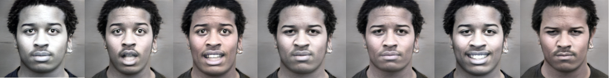

# Asterix

# Set up:
* Download the [StylGan model](https://drive.google.com/file/d/1Y0WMfL7LFgjJy-8FbxhmS1K-YXHRNwKs/view?usp=sharing)
* Download our [models](https://drive.google.com/file/d/1Y0WMfL7LFgjJy-8FbxhmS1K-YXHRNwKs/view?usp=sharing)
* Unzip those files in the root directory as well as Directions.zip

# Directions:

Emotion latents were calculated using the OSU dataset. Then we computed each basic emotion direction in the latent space applying linear regression (see directions.py, vectors can be found in **models/m2**).
Alternatively, to gain more variability in the facial expression depicted by each emotion we also mixed some basic emotions with compound emotions like "happily surprised" which are present in the OSU dataset (vectors can be found in **models/m7**).

# Running the whole pipeline:

An example run the classifier on the Cohn Kanade dataset:
```
Example
CUDA_VISIBLE_DEVICES=0 python transform_lr.py --dataset 'CK' --output_size 256 --k 10 --augment 3 --frames 3 --hpos 1 --hneg 1 --models twoDLDA
```

For each instance, we create the latent space and the image space using the precomputed directions for each of the 6 basic emotions (in the example, --augment 3 indicates that for each emotion 3 alternative directions are employed for increased variability). The intensity of each group of emotions (positive or negative) can be set through the hneg and hpos parameters.
Then 2DLDA (k=10) + PCA(k=2) is applyed to the image space to obtain a 2D space where KNN is used to classify an instance. 
On the other hand, LDA is applyed to the latent space and KNN is also used to classify an instance. We expect this model to perform worse than the previous one (spoiler: not happening).

It's also possible to just generate the image space from a specific image path:

```
CUDA_VISIBLE_DEVICES=0 python -W ignore transform_lr.py --image_path "path/to/image.jpg" --output_size 256  --hpos 1 --hneg 1 --frames 3 --models twoDLDA
```

